# Workflow: How to Use DomainSpec Agents (with Examples)

> See full examples of DomainSpec in action in the [domain-spec-examples](https://github.com/Anddd7/domain-spec-examples/pulls).

This page explains:

- Which agent to use at each phase.
- What to ask the agent.
- What artifacts you should get back.
- How feedback flows upstream as change requests and bugs.

## At a glance

| Phase                              | Lead                  | Primary agent                                                           | Main output                                   |
| ---------------------------------- | --------------------- | ----------------------------------------------------------------------- | --------------------------------------------- |
| Inception: Domain                  | Domain Expert         | [Domain Analysis Assistant](agent-domain-analysis-assistant.md)         | Glossary, context/event map, four-color model |
| Inception: Architecture            | Architect             | [Architecture Design Assistant](agent-architecture-design-assistant.md) | System/service design and ADRs                |
| Iteration 0: Process design        | Tech Lead + Architect | [Process Design Assistant](agent-process-design-assistant.md)           | Procedures, stories, implementation guidance  |
| Iteration 1..n: Story delivery     | Engineer              | [Developer](agent-developer.md)                                         | Plan, code, tests, dev report                 |
| Iteration 1..n: Feature validation | Engineer/QA           | [Validator](agent-validator.md)                                         | Test plan/code/report, bugs/change requests   |

## Inception: initial domain and architecture

> Human-led, agent-assisted.

### 1) Domain analysis

Domain Expert asks [Domain Analysis Assistant](agent-domain-analysis-assistant.md) to analyze initial requirements and produce domain artifacts.


Suggested prompt:

```txt
Analyze the attached requirements for a multi-tenant agile planning product.

Also list assumptions and low-confidence classifications that need domain-expert confirmation.
```

Expected artifacts:

- `glossary.md` with key terms and definitions.
- `context-map.md` with bounded contexts and relationships.
- `event-map.md` with domain events and producer/consumer mapping.
- `four-color-model.md` with entities, value objects, aggregates, and services.
- A list of ambiguities/questions for domain clarification.

---

Example clarification output:

```txt
Low-confidence classifications flagged:

⚠️ Product Backlog in four-color-model.md: modeled as Description, but it may be absorbed into Product depending on implementation style.
⚠️ Priority in four-color-model.md: exact priority scale is not specified in requirements.
⚠️ Tenant Membership in four-color-model.md: implied by access rule R8, but lifecycle and registration details are not fully defined.
```



### 2) Architecture design

Architect asks [Architecture Design Assistant](agent-architecture-design-assistant.md) to design an initial architecture based on domain artifacts.


Suggested prompt:

```txt
Based on domain artifacts in `spec/domain`, design the initial architecture.
```

Expected artifacts:

- High-level architecture design (system context, services, communication patterns).
- ADRs documenting key technical decisions and trade-offs.
- Service-level design (APIs, internal layers, ownership boundaries).

**Keep in mind**: initial domain and architecture are starting points. They should evolve as implementation and validation produce new evidence.

## Iteration 0: procedure design and story shaping

> Human-led, agent-assisted.

Tech Lead and Architect ask [Process Design Assistant](agent-process-design-assistant.md) to define delivery procedures and implementation-ready stories.


Suggested prompt:

```txt
Define a repeatable engineering procedures for this architecture.

Preferred language and frameworks are Node.js and golang, and ...
```

Expected artifacts:

- Standardized development procedures (for example: create endpoint, implement use case, write tests).
- Stories with clear acceptance criteria and implementation constraints.
- Change requests back to architecture/domain when process realities reveal gaps.

## Iteration 1..n: story implementation and validation

> Agent-led, human-reviewed.

### 1) Story implementation

Engineer picks a story and assigns it to [Developer](agent-developer.md).


Suggested prompt:

```txt
Implement `STORY-001` end-to-end.
```

Expected artifacts:

- Story-level implementation plan with decisions and blockers/questions.
- Code changes.
- Unit/integration test changes.
- Development validation report.

---

Example output:

```txt
Implemented STORY-001 with a minimal Node.js forwarding gateway and passing unit tests.

What was added:
    1. Implementation plan: PLAN-STORY-001.md
    2. Gateway package + entrypoint:
        - package.json
        - index.js
    3. Gateway server logic:
        - server.js
    4. Unit tests:
        - server.test.js
    5. Dev validation + notice:
        - .validation-report.md
        - dev-updated-20260317-001200.md

Acceptance criteria coverage:
    1. AC1 forwarding:
        Routes starting with /products are forwarded to PBM upstream; /tenant-access and /tenants are forwarded to TAC upstream.
    2. AC2 unmatched route:
        Returns deterministic 404 JSON with error route-not-found.
    3. AC3 upstream failure:
        Returns deterministic 504 JSON on timeout and 502 JSON on connectivity failure.
    4. AC4 Node.js minimal behavior:
        Implemented in plain Node.js as forwarding-only gateway with no business logic.

Test result:
    1. Ran npm test in api-gateway
    2. 5 tests passed, 0 failed.

```

### 2) Feature validation

Once one or more stories form a feature slice, ask [Validator](agent-validator.md) to validate against requirements and report gaps.


Suggested prompt:

```txt
Validate feature scope against `README` requirements R1-R8. Write test plan, code and report to files.
```

Expected artifacts:

- Test plan, test code, and test report.
- Explicit pass/partial/fail status by requirement.
- Bug/change request artifacts when validation finds issues.

---

Example validation output:

```txt
Requirement status against README.md:

  1. R1 Tenant can create Product: Pass
  2. R2 Product Owner can add Backlog Item: Pass
  3. R3 Backlog Item states include Planned, Scheduled, Committed, Done, Removed: Partial
  4. R4 Product Owner can create Sprint: Pass
  5. R5 Schedule Backlog Item into Sprint, state becomes Scheduled: Pass
  6. R6 Team Member can commit, state becomes Committed: Pass
  7. R7 Team Member can mark Done: Pass
  8. R8 Only same-tenant registered Team Members can interact: Pass for tested protected operations

  Key black-box evidence I executed:

  1. Automated tests all pass
  2. Gateway tests: forwarding, deterministic not-found, timeout/connectivity error handling all pass
  3. Tenant access tests: register/verify allow, unregistered deny, duplicate conflict all pass
  4. Product backlog tests: create-to-done flow, cross-product scheduling rejection, already-scheduled rejection, deny-does-not-persist transition all pass
  5. Live API checks through gateway:
  6. Successful create product, add item, create sprint, schedule, commit, done with expected 200 responses and expected states
  7. Invalid story points 4 rejected with 400 and message that story points must be Fibonacci
  8. Invalid sprint date range rejected with 400 and message that end date must be after start date
  9. Unregistered member denied scheduling with 403; registered member succeeds
  10. Cross-product schedule rejected with 400
  11. Re-scheduling already scheduled item rejected with 409

  Why this is not fully implemented:

  1. I found no exposed behavior to move an item to Removed state, while R3 requires Removed as part of the supported lifecycle.
  2. Existing story scope in STORY-003-backlog-service-bootstrap.md covers Create, Add, CreateSprint, Schedule, Commit, Done, but not a Remove operation.
```

---

## Communication protocols between layers

**Notice**: Upstream layers transfer information to downstream layers through artifacts.

**Change-Request**: Downstream layers report issues, questions or requests back to upstream layers.

**Bug**: Also a type of change request, but specifically for issues found in validation or running system that require upstream attention.

See details in [Cross-layer Communication](cross-layer-communication.md).
